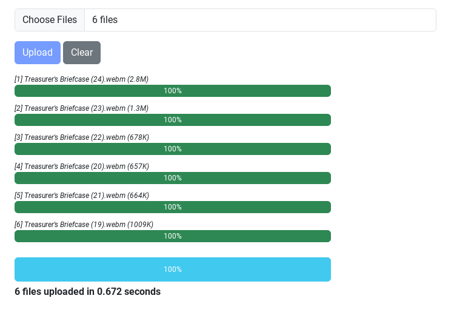

# Upload Files POC

This is a _proof-of-concept_ project that demonstrates the use of
Redis to monitor file uploads.

The project also demonstrates the use of Bootstrap progress bars.




# Problem

* You want to upload some files
* You want to give the user some feedback (progress bar)

# Solution

* use a Perl CGI to handle upload requests
* implement a hook in the CGI script that records the progress of each
  file to a Redis cache
* use a Perl CGI to provide an API for retrieving status information
  on each file
* use a Javascript AJAX call to request status information from the
  Perl CGI every 1/10th of a second during the upload 
* use a Bootstrap progress bar to give visual feedback to the user

# Flow

1. user selects files to upload
1. front-end makes AJAX call to initialize upload
   1. a list of files to upload and their sizes is sent to the API
   1. the API stores the list of files using a session id as the key
   1. the API returns the list of files with some decorations (human
      readable size)
1. front-end uses list of files to create Bootstrap progress bars
1. user clicks upload
1. front-end submits each files in a new form to the upload script
1. back-end begins uploading file and records project in the hook
   method to the Redis cache
   * percent complete
   * elapsed time (in milliseconds)
   * elapsed time formatted (%6.3f)
   * bytes read
1. front-end sets an interval function which will call API to fetch
   status every every 1/10th of second
1. API fetches status for all files from Redis cache and returns to
   front end
1. front-end updates each progress bar, status message
   1. if any file is 100% complete, update the number of files
      uploaded
   1. when all files uploaded, clear interval function

# Additional Gory Details

## Use of the Redis Cache

* The CGI writes a file list using the a session id derived from a
  cookie as the key. The file list is stored as a JSON string.
* The status for each file is stored using a key derived from the
  filename and the session id (MD5 hash) to guarantee uniqueness for
  an individual session and file.
* The cache entries are set to expire after some interval of time
  (configurable) so that the cache is somewhat _self-cleaning_.
  
## Configuration

The CGI uses a configuration file (`upload.json`) in JSON format that allows one to
configure several aspects of the upload. Logging is done using
`Log::Log4perl`.

Most of the values below should be self explanatory.

```
{
    "log" : {
        "file" : ">>/var/www/log/upload.log",
        "level" : "info"
    },
    "upload" : {
        "path" : "/tmp",
        "timeout" : {
            "session" : 60,
            "file" : 60
        }
    },
    "redis" : {
        "server" : "172.18.0.1",
        "port" : 6379
    },
    "template" : {
        "upload-form": "upload-form.tt",
        "include_path" : "/var/www/include",
        "absolute" : 1,
        "interpolate" : 0
    },
    "session" : {
        "cookie_name" : "SessionID"
    }
}

```

* `upload.timeout.session` - amount of time the session key will
  remain active after the last access
* `upload.timeout.file` - amount of time the file key will remain
  active after the last access. Both the session and file key expireat
  time are reset each time a file status is updated.
* `cookie_name` - name of the cookie that holds a session identifier

# Contributing

Patches, PRs welcome.

# Author

Rob Lauer - <rlauer6@comcast.net>

# License

This program is free software; you can redistribute it and/or modify
it under the terms as Perl itself.
